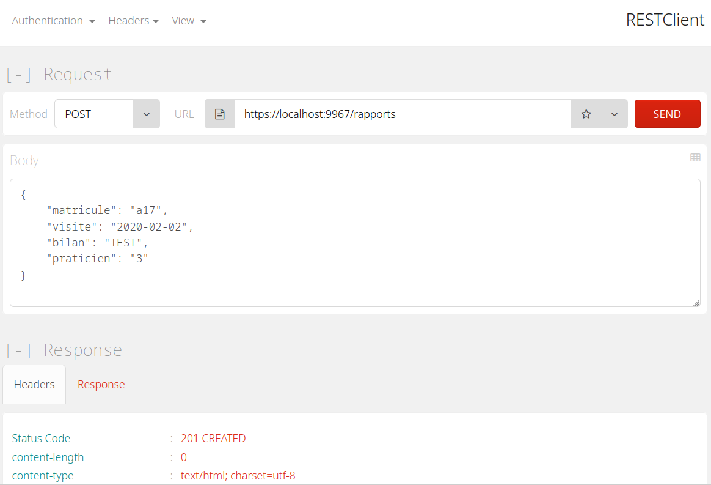

GSB RV Visiteur Serveur [](https://github.com/AladdineDev/GSB-RV-Visiteur-Serveur/blob/master/LICENSE.md)
========================

GSB Rapports Visite - module Visiteur (Serveur) – par [@AladdineDev](https://github.com/AladdineDev)

[](https://www.python.org/)
[](https://flask.palletsprojects.com/en/2.0.x/)
[](https://mariadb.org/)

Service Web REST de l'application [GSB-RV-Visiteur](https://github.com/AladdineDev/GSB-RV-Visiteur).

</img>

### Documentation

  * [Documentation utilisateur](docs/Documentation-Utilisateur.pdf) _(À venir)_
  * [Documentation technique](docs/Documentation-Technique.pdf) _(À venir)_

### Contexte

1. [GSB - Fiche descriptive](docs/01-GSB-AppliRV-FicheDescriptive.pdf)
2. [GSB - Cas d'utilisation](docs/02-GSB-AppliRV-Visiteur-UC.pdf)
3. [GSB - Modèle Entité-Association](docs/03-GSB-AppliRV-MEA.pdf)
4. [GSB - Diagramme de navigation](docs/04-GSB-AppliRV-Navigation.pdf)
5. [GSB - Documentation API / Arborescence](docs/05-GSB-AppliRV-Documentation-API.pdf)

### Prérequis

  * [Docker](https://docs.docker.com/get-docker)
  * [Docker compose](https://docs.docker.com/compose/install)

> En cas de difficulté, reportez-vous à la documentation officielle de [Docker](https://docs.docker.com/).

## Installation

_À savoir :_ ce dépôt ne constitue que la partie serveur / service web du projet [GSB-RV-Visiteur](https://github.com/AladdineDev/GSB-RV-Visiteur) qui devra être installé par la suite.

Tout d'abord, créez le répertoire qui contiendra les dépôts [GSB-RV-Visiteur-Serveur](https://github.com/AladdineDev/GSB-RV-Visiteur-Serveur) et [GSB-RV-Visiteur](https://github.com/AladdineDev/GSB-RV-Visiteur) et positionnez-vous dedans : 

```bash
$ mkdir AppliRV
$ cd AppliRV
```

Ensuite, clonez ce dépôt et placez-vous au sein du projet :

```bash
$ git clone https://github.com/AladdineDev/GSB-RV-Visiteur-Serveur
$ cd GSB-RV-Visiteur-Serveur
```

Puis, générez un certificat SSL :

```bash
$ cd certificate
$ openssl req -x509 -newkey rsa:2048 -nodes -keyout key.pem -out cert.pem -days 365 -config openssl.cnf
```

Enfin, construisez et lancez les conteneurs Docker :

```bash
$ docker-compose up -d --build
```

Vous pouvez maintenant accéder au serveur web depuis votre navigateur à l'URL suivante : [`https://localhost:9967`](https://localhost:9967)

> N'oubliez pas de consulter la [documentation de l'API](docs/05-GSB-AppliRV-Documentation-API.pdf) pour connaître les endpoints.

Pour exploiter ce projet, poursuivez avec l'installation du projet [GSB-RV-Visiteur](https://github.com/AladdineDev/GSB-RV-Visiteur).

## Licence

Voir le fichier [LICENSE.md](https://github.com/AladdineDev/GSB-RV-Visiteur-Serveur/blob/master/LICENSE.md) fourni.